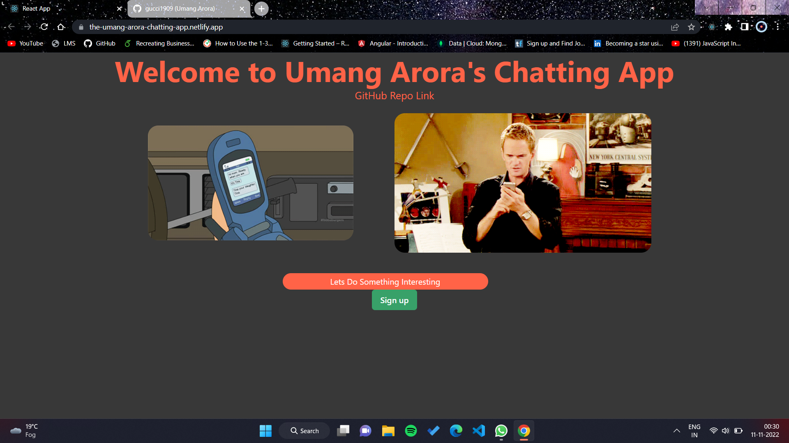

# Umang-Chatting-App

> Have a look on my chatting-app , I made it in my free time . Fell safe signing up in this app as I've used firebase for that and then , chat with people . You can edit or delete the messages you sent there . The best thing about the app is that your messages will be automatically deleted after it reaches a certain limit in the chat box . 

## Built With

- React.js
- Firebase
- Node.js
- Express
- Mongo DB
- Render
- Chakra UI

## Live Demo 

[Netlify link available here](https://the-umang-arora-chatting-app.netlify.app/)

## Screenshots



## Run Locally

Clone the project

```bash
  git clone https://github.com/gucci1909/Umang-Chatting-App.git
```

Go to the project directory

```bash
  cd chatting-app
```

Install dependencies

```bash
  npm install
```

Start the server

```bash
  npm run start
```


### Prerequisites
React.js,Chakra UI,Firebase,Express,Mongo DB,Api,Render.

### Setup
VS code,
GitHub,Mongo DB,Heroku


## Author

👤 **Umang Arora**

- GitHub: [@gucci1909](https://github.com/gucci1909)


